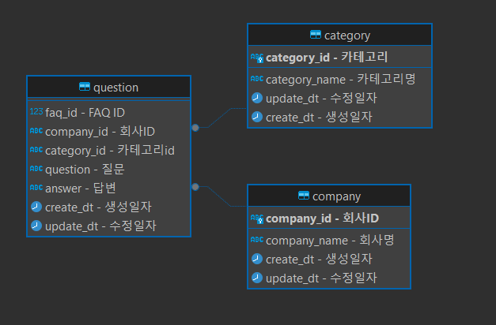

# 👑SKN04-1st-1Team👑
<p align="center"></p>

<hr>

### 🤗 팀명 : 짜않투않
 
### 🤭 팀원

<p align="center">
	
	
	
	
</p>

<div align="center">
	
|   &nbsp;&nbsp; &nbsp; &nbsp; &nbsp;  &nbsp;  &nbsp;  🐖김정훈  &nbsp;&nbsp; &nbsp;&nbsp; &nbsp;  &nbsp;  &nbsp;    |      &nbsp;&nbsp; &nbsp;&nbsp; &nbsp;  &nbsp;  &nbsp; 🐱김문수  &nbsp;&nbsp; &nbsp;&nbsp; &nbsp;  &nbsp;  &nbsp;    |      &nbsp;&nbsp; &nbsp;&nbsp; &nbsp;  &nbsp;  &nbsp; 🐂김효은  &nbsp;&nbsp; &nbsp;&nbsp; &nbsp;  &nbsp;  &nbsp;    |     &nbsp;&nbsp; &nbsp;&nbsp; &nbsp;  &nbsp;  &nbsp; 🐴고유림  &nbsp;&nbsp; &nbsp;&nbsp; &nbsp;  &nbsp;  &nbsp;   | 
|------------------------------------------|--------------------------------------|------------------------------------------|-----------------------------------|
 
</div>

<hr>

# CARFAQ 시스템


### 👨‍🏫 프로젝트 개요
  
  CARFAQ 시스템은 한번의 클릭으로 지정된 사이트의 FAQ를 검색하고 전국 자동차 등록 현황을 확인하는 서비스입니다.

<hr>

### 👩‍🏫 프로젝트 소개

  1. 전국 자동차 등록 현황을 통합 관리하는 데이터베이스를 구축하여 시각적 대시보드로 확인가능합니다.
  
  2. 기업 FAQ 시스템을 설계하여 고객의 자주 묻는 질문을 효과적으로 관리하고, 자동화된 답변 제공 기능을 통해 고객을 지원합니다.
  
<hr>

### 👩‍🏫 프로젝트 필요성

  현재 자동차 등록 현황에 대한 정보는 다양한 기관과 시스템에 분산되어 있어 사용자가 일관된 정보를 얻기 어렵습니다. 
  또한, 기업 FAQ는 고객의 질문에 대한 빠르고 정확한 답변을 제공하기 위해 체계적인 관리가 필요합니다. 
  이 프로젝트는 자동차 등록 현황과 다양한 기업 FAQ를 통합하여 사용자에게 다양한 정보를 한 눈에 제공합니다.
  이는 정보 접근성을 높이고, 고객 만족도를 증가시키며, 업무 처리를 자동화하는 데 기여합니다.
  
<hr>

### 👩‍🏫 프로젝트 목표

  본 프로젝트의 주요 목표는 두 가지입니다. 
  첫째, 전국 자동차 등록 현황을 통합 관리하는 데이터베이스를 구축하고, 자동으로 크롤링 하여 조회할 수 있는 웹 기반 플랫폼입니다. 
  둘째, 기업 FAQ 시스템을 설계하여 고객의 자주 묻는 질문을 효과적으로 관리하고, 자동화된 답변 제공 기능을 통해 고객 지원을 개선하는 것입니다. 

### 🔨 기술 스택
<div>
  
  
  
  
  
  
</div>

<hr>

### Postgres

### 💻 DB 테이블 - ERD 

<p align="center"></p>

<hr>

### 📚 주요 프로시저
<summary><b>1. 각 사이트 크롤링</b></summary>

<summary><b>2. FAQ 시스템 관리</b></summary>

<summary><b>3. 검색 및 필터링</b></summary>

<summary><b>4. 시각적 대시보드</b></summary>


### 📝 한줄회고
```
고유림 - 처음에는 간단하게 만들자! 라는 생각에서 점점 욕심이 생겨 더 좋은 결과물을 보이자라는 생각이 들었다. 그래서 주제에 벗어나진 않는지, 과정을 계속 생각하며 다음번의 프로젝트 또한 기대된다.
```
```
김정훈 - git을 통해 여러 팀원들과 협업하여 좋았습니다. 다음 결과물은 더 잘 할 수 있다는 자신감을 얻을 수 있었습니다.
```
```
김효은 - 내가 작성한 코드로 이런 결과물을 구현해내다니 대단해! 개발자들은 참 똑똑한 것 같다
```
```
김문수 - 개발 기간이 너무 적어 힘들었습니다. 그래도 끝나 좋습니다. 하하하.
```