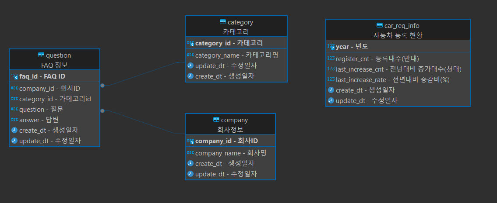

# 👑SKN04-1st-1Team👑

### 🤗 팀명 : 짜않투않
 
### 🤭 팀원

	
	
	
	

	
|   &nbsp;&nbsp; &nbsp; &nbsp; &nbsp;  &nbsp;  &nbsp;  🐖김정훈  &nbsp;&nbsp; &nbsp;&nbsp; &nbsp;  &nbsp;  &nbsp;    |      &nbsp;&nbsp; &nbsp;&nbsp; &nbsp;  &nbsp;  &nbsp; 🐱김문수  &nbsp;&nbsp; &nbsp;&nbsp; &nbsp;  &nbsp;  &nbsp;    |      &nbsp;&nbsp; &nbsp;&nbsp; &nbsp;  &nbsp;  &nbsp; 🐂김효은  &nbsp;&nbsp; &nbsp;&nbsp; &nbsp;  &nbsp;  &nbsp;    |     &nbsp;&nbsp; &nbsp;&nbsp; &nbsp;  &nbsp;  &nbsp; 🐴고유림  &nbsp;&nbsp; &nbsp;&nbsp; &nbsp;  &nbsp;  &nbsp;   | 
|------------------------------------------|--------------------------------------|------------------------------------------|-----------------------------------|
 

# CARFAQ 시스템

### 👨‍🏫 프로젝트 개요
  
  CARFAQ 시스템은 한번의 클릭으로 지정된 사이트의 FAQ를 검색하고 전국 자동차 등록 현황을 확인하는 서비스입니다.

### 👩‍🏫 프로젝트 소개

  1. 전국 자동차 등록 현황을 통합 관리하는 데이터베이스를 구축하고, 이를 실시간으로 조회할 수 있는 웹 기반 플랫폼을 개발하는 것입니다.
  
  2. 기업 FAQ 시스템을 설계하여 고객의 자주 묻는 질문을 효과적으로 관리하고, 자동화된 답변 제공 기능을 통해 고객 지원을 개선
  

### 👩‍🏫 프로젝트 필요성

  현재 자동차 등록 현황에 대한 정보는 다양한 기관과 시스템에 분산되어 있어 사용자가 일관된 정보를 얻기 어렵습니다. 또한, 기업 FAQ는 고객의 질문에 대한 빠르고 정확한 답변을 제공하기 위해 체계적인 관리가 필요합니다. 이 프로젝트는 자동차 등록 현황과 기업 FAQ를 통합하여 사용자에게 일관된 정보를 제공하고, 기업의 고객 지원 효율성을 향상시키는 솔루션을 제공합니다. 이는 정보 접근성을 높이고, 고객 만족도를 증가시키며, 업무 처리를 자동화하는 데 기여할 것입니다.
  

### 👩‍🏫 프로젝트 목표

  본 프로젝트의 주요 목표는 두 가지입니다. 첫째, 전국 자동차 등록 현황을 통합 관리하는 데이터베이스를 구축하고, 이를 실시간으로 조회할 수 있는 웹 기반 플랫폼을 개발하는 것입니다. 둘째, 기업 FAQ 시스템을 설계하여 고객의 자주 묻는 질문을 효과적으로 관리하고, 자동화된 답변 제공 기능을 통해 고객 지원을 개선하는 것입니다. 이 시스템은 사용자 친화적인 인터페이스를 제공하고, 정확하고 신속한 정보를 통해 사용자 경험을 극대화하는 것을 목표로 합니다

### 🔨 기술 스택 #나중

  
  

### Postgres

### 💻 DB 테이블 - ERD 

  

### 📚 주요 프로시저

<b>1. 전국 자동차 등록 현황 조회</b>

<b>2. FAQ 시스템 관리</b>

<b>3. 검색 및 필터링</b>

<b>4. 시각적 대시보드</b>

### 📝 한줄회고
